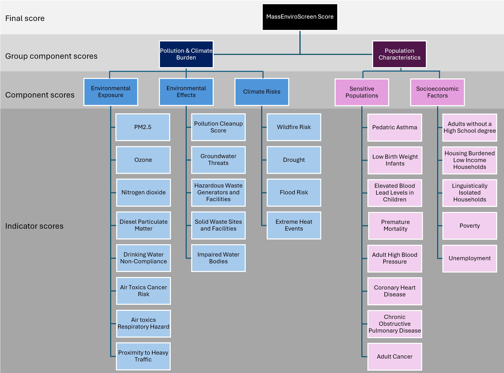

# MassEnviroScreen

This repository shares the R code for generating the data for [MassEnviroScreen](https://experience.arcgis.com/experience/0e1a1991dd4b4b37ba0298bf74f347a0 "Link to MassEnviroScreen mapping tool"), a GIS-based mapping tool designed to identify communities facing the greatest environmental burdens and levels of social vulnerability in Massachusetts, USA. MassEnviroScreen integrates 30 statewide indicators into a cumulative burden score that incorporates exposure to pollution and climate risks and the intersection of these risks with conditions of vulnerability – the health and socioeconomic characteristics of communities. This tool was developed to support consistent, data-informed approaches to understanding cumulative environmental and social burdens across the Commonwealth of Massachusetts.

The MassEnviroScreen interactive mapping tool, data, and [detailed documentation](https://www.mass.gov/doc/massenviroscreen-technical-documentation-may-8-2026/download "Download MassEnviroScreen Technical Documentation PDF"), are available [here](https://www.mass.gov/info-details/cumulative-impact-analysis "Link to MA Cumulative Impact Analysis webpage").

## MassEnviroScreen Model

MassEnviroScreen is a GIS-based mapping tool developed and administered by the Massachusetts [Office of Environmental Justice and Equity (OEJE)](https://www.mass.gov/orgs/office-of-environmental-justice-equity-oeje) that uses indicators to produce a MassEnviroScreen Score and provide indicator data for every census block group across the Commonwealth. The MassEnviroScreen cumulative burden score is a composite indicator that measures a multi-dimensional concept that cannot be captured by an individual indicator.

This cumulative burden composite indicator follows guidance from the Organization for Economic Co-operation and Development (OECD)[^readme-1] and the National Academies of Sciences, Engineering, and Medicine,[^readme-2] and is modeled on the approaches used by [California EPA’s CalEnviroScreen tool](https://oehha.ca.gov/calenviroscreen) and the [Colorado EnviroScreen tool](https://www.cohealthmaps.dphe.state.co.us/COEnviroscreen_2/). The California and Colorado tools utilize a ‘cumulative impact score’ to describe the relative environmental burden of communities across the state and to prioritize those that are most burdened. California defines cumulative impacts as “the exposures, public health or environmental effects from the combined emissions and discharges, in a geographic area, including environmental pollution from all sources, whether single or multi-media, routinely, accidentally, or otherwise released.” Impacts consider “sensitive populations and socio-economic factors, where applicable and to the extent data are available.” The Colorado tool augments the CalEnviroScreen approach by adding climate risks, which is the approach followed here.

[^readme-1]: OECD, *Handbook on Constructing Composite Indicators*. Organisation for Economic Co-operation and Development, 2008. <https://www.oecd.org/els/soc/handbookonconstructingcompositeindicatorsmethodologyanduserguide.htm>; National Academies of Sciences, Engineering, and Medicine, *Constructing Valid Geospatial Tools for Environmental Justice*. National Academies Press, 2024. <https://doi.org/10.17226/27317>.

[^readme-2]: National Academies of Sciences, Engineering, and Medicine, *Constructing Valid Geospatial Tools for Environmental Justice*; OECD, *Handbook on Constructing Composite Indicators*.

A ‘cumulative burden score’ in MassEnviroScreen is a numerical value that ranks every community (i.e., census block group) on a scale from 0 to 100. Higher values indicate greater cumulative burden. These values also represent percentile ranks, which means that a community’s score indicates the percentage of scores in Massachusetts that are equal to or lower than a given score. For example, a census block group with a score of 75 (75th percentile) means that its cumulative burden score is equal to or higher than 75% of census block groups in the state. In this model, we follow California’s example of using a score of 75 (the 75th percentile) as one of the thresholds for identifying the most impacted or ‘Burdened Areas.’

MassEnviroScreen uses the census block group as the geographic unit of analysis. Block groups are the second smallest unit in the Census. A census block group is a statistical division of census tracts and consists of clusters of census blocks. Census block groups in Massachusetts generally contain between 350 and 3,200 people. The US Census Bureau uses these boundaries to summarize data from its Decennial Census and from the annual American Community surveys. A census block group is the smallest division of U.S. Census data that provides detailed demographic data such as household income, educational attainment, English language isolation, or unemployment information. The census block group provides a higher resolution or more granular view than a census tract, ZIP code, or municipality can.

MassEnviroScreen uses the 2020 census block group boundaries from the US Census. Massachusetts is divided into 5,116 census block groups.

Census block groups with a minimum score of 75 experience cumulative burdens that are equal to or higher than 75% of block groups in the state. In other words, these block groups represent the top 25% of cumulative burden scores in Massachusetts.

Burdened Areas are communities (i.e., census block groups) that meet one or more of the following criteria:

- cumulative burden percentile score (i.e, MassEnviroScore) of 75 or greater, OR

- annual median household income is 65 percent or less of the statewide annual median household income

## Scoring Methodology

The MassEnviroScreen cumulative burden score model is based on three components that represent Pollution and Climate Burden – Exposures, Environmental Effects, and Climate Risks – and two components that represent Population Characteristics – Sensitive Populations (e.g., in terms of health status) and Socioeconomic Factors.

Figure 1 - MassEnviroScreen components


## Model Characteristics

The model:

- Uses 30 statewide indicators to characterize Pollution and Climate Burden and Population Characteristics

- Uses percentiles to assign scores for each of the indicators in a given geographic area. The percentile represents a relative score for the indicators. **Please note: A higher percentile score does not necessarily mean that the indicator exceeds regulatory thresholds or poses direct human health risks at that** **score.**

- Uses a scoring system in which the percentiles are averaged for the set of indicators in each of the five components (Exposures, Environmental Effects, Climate Risks, Sensitive Populations, and Socioeconomic Factors).

- Combines the component scores to produce a MassEnviroScreen score for a given area relative to other areas in the state, using the formula in Figure 3.

## MassEnviroScreen Indicators and Components

An “indicator” is a statistical measure, which is used to evaluate a census block group’s environmental exposures, environmental effects, climate effects, sensitive populations, and socioeconomic factors. Indicators were selected based on their association with cumulative health impacts and social vulnerability based on peer reviewed literature, input from environmental and public health experts, input from community and industry stakeholders, and prevailing practice by other government agencies across the country. Indicator selection was restricted to those datasets that are:

- publicly available,

- derived from official or authoritative sources of data,

- updated on a regular basis,

- represent statewide concerns (i.e., not just localized to a specific region), and

- available at, or able to be aggregated to, census block groups.

### Model Indicators

The MassEnviroScreen score model is computed from 30 statewide environmental, socioeconomic, and health indicators. MassEnviroScreen indicators are grouped into five broad components, which are further aggregated into two group components, described below. These indicators are listed by indicator category in Figure 2 - MassEnviroScreen Indicators.

Figure 2 - MassEnviroScreen Indicators

{fig-alt="Diagram of MassEnviroScreen indicators hierarchy tree"}

### Pollution and Climate Burden Indicators

Pollution and Climate Burden indicators refer to those factors that increase the probability of a community being exposed to environmental risks. In the MassEnviroScreen tool, Pollution and Climate Burden indicators are a group component comprised of three components: Environmental Exposures, Environmental Effects, and Climate Risk.

#### Environmental Exposures

Environmental exposure indicators include factors that could lead to direct population exposure in a geographical location. People may be exposed to a pollutant if they come in direct contact with it, by breathing contaminated air, for example. However, environmental exposure indicators do not provide data on personal or real-time exposure to pollution.

#### Environmental Effects

Environmental effects indicators refer to environmental factors that have been associated with environmental degradation, ecological effects, and threats to the environment and communities. Environmental effects indicators include factors that could lead to indirect population exposure to an environmental threat or limit a community’s ability to use ecosystem resources or services in a geographical location. Environmental effects do not provide personal or real-time exposure to pollution or lack of access to ecosystem resources or services.

#### Climate Risks

Climate risk indicators refer to climate change risks associated with human health impacts. Climate risk provides a description of the population's risk level. MassEnviroScreen does not provide a personal or real-time estimate of risks due to climate factors.

### Population Characteristics Indicators

Population Characteristics indicators refer to those factors that increase biological susceptibilities and social vulnerabilities to environmental exposures and risks. In this tool, Population Characteristics are a group component comprised of two components: Sensitive Populations and Socioeconomic Factors.

#### Sensitive Populations

These indicators refer to physiological conditions or health status that result in increased susceptibility to environmental risks. Pollutant exposure is a likely contributor to many observed adverse outcomes, and has been demonstrated for some outcomes such as asthma, low birth weight, and heart disease. People with these health conditions are also more susceptible to health impacts from pollution. However, adverse health conditions are difficult to attribute solely to exposure to pollutants.

#### Socioeconomic Factors

These indicators refer to social determinants of health that are known to produce social vulnerabilities and affect health and are a common source of health and environmental disparities.

## Indicator Scoring

Indicator values were normalized by assigning percentile scores based on the order of census block group indicator values from highest to lowest for the entire state. A percentile score was calculated from the ordered values for all block groups that have a score. Each block group’s percentile rank for a specific indicator is relative to the ranks for that indicator in the rest of the block groups in the state.

In some circumstances, an indicator may not have data available for every census block group. The MassEnviroScreen Score calculation clearly distinguishes between indicator values of zero and those that are missing or not available (“NA”). A zero value is assumed to represent a valid measure of a specific indicator. For example, a census block group can have zero percent of its area classified as a floodplain. By contrast, an NA value implies that no data was available or possible at this given location. An NA value does not contribute to the component score calculation for a given geography. For example, 17 census block groups lack data on the prevalence of high blood pressure due to limitations in the underlying modeled data acquired from the U.S. Centers for Disease Control and Prevention. Those 17 block groups with NA values for high blood pressure do not receive percentile scores and do not contribute to the averaged component score for sensitive populations. Because the percentile score ignores NA values, the percentile score can be thought of as a comparison of one geographic area to other localities in the state where the hazard effect or population characteristic is present. This approach to zero values and NA values is consistent with the composite map approaches adopted by the US EPA's EJScreen, FEMA's National Risk Index, CalEnivroScreen, Colorado's EnviroScreen, and other similar state mapping tools.

Each census block group receives scores for as many of the 30 indicators as possible. Although all indicators represent statewide data sources, some census block groups will not have scores for every one of the indicators due to gaps or omissions in the underlying data.

## Component Scoring

Indicators from the Environmental Exposures, Environmental Effects, and Climate Risks components were grouped together to represent Pollution and Climate Burden. Indicators from the Sensitive Populations and Socioeconomic Factors components were grouped together to represent Population Characteristics.

For a given census block group, scores for the Pollution and Climate Burden and Population Characteristics group components are calculated as described below (see example calculation later in this document):

1.  The percentiles for all the individual indicators in a component are averaged. This becomes the score for that component. When combining the Environmental Exposures, Environmental Effects, and Climate Risks components, the Environmental Effects and Climate Risks component scores were weighted half as much as the Environmental Exposures component score. This was done because the contribution to possible burden from the Environmental Effects or Climate Risks components is considered less certain or less direct than those from sources in the Environmental Exposures component. The Environmental Effects and Climate Risks components represent the presence of pollutants or risks in a community rather than exposure to them. The Environmental Exposure component receives twice the weight of the Environmental Effects and Climate Risks components.

2.  The Population Characteristics score is the average of the Sensitive Population score and Socioeconomic Factors score.

3.  The Pollution and Climate Burden and Population Characteristics group component scores are then scaled so that they have a possible range of 0 to 10 with a maximum value of 10.

4.  Each group component average is divided by the maximum value observed in the state and then multiplied by 10. The scaling ensures that the Pollution and Climate Burden group component and Population Characteristics group component contribute equally to the overall MassEnviroScreen Score.

## Formula for calculating MassEnviroScreen Score

After the components are averaged within Pollution and Climate Burden and Population Characteristics, the group component scores are combined as follows to calculate the overall MassEnviroScreen Score:

Figure 3 – Formula for MassEnviroScreen cumulative burden score

{fig-alt="MassEnviroScreen diagram of final formula"}

\* The Environmental Effects and Climate Risks scores were weighted half as much as the Exposures score.

Scores for the Pollution and Climate Burden and Population Characteristics categories are multiplied (rather than added, for example). Although this approach may be less intuitive than simple addition, there is scientific and practical support for this approach to scoring.

Multiplication was selected for the following reasons:

- *Scientific Literature*: Numerous studies have shown that socioeconomic and sensitivity factors amplify the health risks posed by environmental pollutants and other exposures, making a simple sum less representative of cumulative burden.[^3]

- *Risk Assessment Principles*: Some people (such as children) may be many times more sensitive to some chemical exposures than others.[^4] Risk assessments apply numerical factors or multipliers to account for potential human sensitivity (as well as other factors such as data gaps) in deriving acceptable exposure levels.[^5] This is a commonly adopted approach for capturing the co-occurrence of conditions in which we know or strongly suspect that there is interaction, but the precise nature of that interaction is complex and incompletely understood.

- *Established Risk Scoring Systems*: Priority rankings done by various emergency response organizations to score threats have used scoring systems with the formula: Risk = Threat × Vulnerability.[^6] These formulas are widely used and accepted in cumulative burden mapping, in part because multiplication creates a wider range of scores than addition, creating more granularity in differentiating risks and creating distinctions that would be overlooked by addition.

- *Non*-*compensability*: Multiplication enforces non-compensability, so that a low social vulnerability score cannot fully “cancel” or compensate for a high pollution exposure or climate risk score, and vice versa. Non-compensability is appropriate when it is not possible, or not desirable, to assume that one condition (e.g., high asthma rates) is somehow offset or compensated by another condition (e.g., low climate risk).[^2]

The MassEnviroScreen interactive mapping tool, data, and [detailed documentation](https://www.mass.gov/doc/massenviroscreen-technical-documentation-may-8-2026/download "Download MassEnviroScreen Technical Documentation PDF"), are available [here](https://www.mass.gov/info-details/cumulative-impact-analysis "Link to MA Cumulative Impact Analysis webpage").

## Repository Files

Below is a description of the files in this repository:

- MassEnviroScreen.R contains the R code that generates the MassEnviroScreen sf object with cumulative impact scores at the census block group level

- MassEnviroScreenYYYY-MM-DD.rds is an R object storing the MassEnviroScreen cumulative impact score sf object generated by MassEnviroScreen.R

- MassEnviroScreenYYYY-MM-DD.csv is a CSV file with MassEnviroScreen scores and Burdend Areas (BAs) identified by census block group

- MES_DataDictionaryYYYY-MM-DD.csv contains field/column names and their definitions or descripations for MassEnviroScreen.csv or MassEnviroScreen.rds

- MES_FieldsYYYY-MM-DD.csv is a list of field/column names for MassEnviroScreen.csv or MassEnviroScreen.rds

The data used to generate the MassEnviroScreen composite indicator is not stored in this repository. ACS data is acquired via the tidycensus API directly in the code. Some layers are downloaded via the `download.file()` function in the code. Some data must be downloaded manually into a data folder with the appropriate path in order to reproduce the workflow. For those simply interested in the final MassEnviroScreen score data, see MassEnviroScreen.csv. To load the sf layer in R, use the following code in R:

``` r
MassEnviroScreen <- readRDS("MassEnviroScreen.rds")
```

The MassEnviroScreen interactive mapping tool, data, and [detailed documentation](https://www.mass.gov/doc/massenviroscreen-technical-documentation-may-8-2026/download "Download MassEnviroScreen Technical Documentation PDF"), are available [here](https://www.mass.gov/info-details/cumulative-impact-analysis "Link to MA Cumulative Impact Analysis webpage").


[^3]: Gloria C. Chi et al., “Individual and Neighborhood Socioeconomic Status and the Association between Air Pollution and Cardiovascular Disease,” *Environmental Health Perspectives* 124, no. 12 (2016): 1840–47, <https://doi.org/10.1289/EHP199>; Jane E. Clougherty et al., “The Role of Non-Chemical Stressors in Mediating Socioeconomic Susceptibility to Environmental Chemicals,” *Current Environmental Health Reports* 1, no. 4 (2014): 302–13, <https://doi.org/10.1007/s40572-014-0031-y>; Carolyn Ingram et al., “Cumulative Impacts and COVID-19: Implications for Low-Income, Minoritized, and Health-Compromised Communities in King County, WA,” *Journal of Racial and Ethnic Health Disparities* 9, no. 4 (2022): 1210–24, <https://doi.org/10.1007/s40615-021-01063-y>; Yi Sun et al., “Exposure to Air Pollutant Mixture and Gestational Diabetes Mellitus in Southern California: Results from Electronic Health Record Data of a Large Pregnancy Cohort,” *Environment International* 158 (January 2022): 106888, <https://doi.org/10.1016/j.envint.2021.106888>; Ruipeng Tong and Boling Zhang, “Cumulative Risk Assessment for Combinations of Environmental and Psychosocial Stressors: A Systematic Review,” *Integrated Environmental Assessment and Management* 20, no. 3 (2024): 602–15, <https://doi.org/10.1002/ieam.4821>; Xiangyu Ye et al., “Associations of Socioeconomic Status with Infectious Diseases Mediated by Lifestyle, Environmental Pollution and Chronic Comorbidities: A Comprehensive Evaluation Based on UK Biobank,” *Infectious Diseases of Poverty* 12, no. 01 (2023): 1–23, <https://doi.org/10.1186/s40249-023-01056-5>.

[^4]: Julia R. Varshavsky et al., “Current Practice and Recommendations for Advancing How Human Variability and Susceptibility Are Considered in Chemical Risk Assessment,” *Environmental Health* 21, no. 1 (2023): 133, <https://doi.org/10.1186/s12940-022-00940-1>.

[^5]: National Research Council, *Science and Decisions: Advancing Risk Assessment* (The National Academies Press, 2009), <https://doi.org/10.17226/12209>.

[^6]: Esther Min et al., “The Washington State Environmental Health Disparities Map: Development of a Community-Responsive Cumulative Impacts Assessment Tool,” *International Journal of Environmental Research and Public Health* 16, no. 22 (2019): 4470, <https://doi.org/10.3390/ijerph16224470>; Yaprak Onat et al., “A State-Specific Approach for Visualizing Overburdened Communities: Lessons from the Connecticut Environmental Justice Screening Tool 2.0,” *Sustainability* 17, no. 10 (2025): 10, <https://doi.org/10.3390/su17104535>; Tim Sheehan et al., “A Comparison of Hazard Vulnerability Indexes for Washington State,” *Journal of Homeland Security and Emergency Management* 20, no. 2 (2023): 59–74, <https://doi.org/10.1515/jhsem-2021-0066>; Margaret M. MacDonell et al., “Characterizing Risk for Cumulative Risk Assessments,” *Risk Analysis* 38, no. 6 (2018): 1183–201, <https://doi.org/10.1111/risa.12933>; ORD US EPA, “Conducting a Human Health Risk Assessment,” Reports and Assessments, July 21, 2014, <https://www.epa.gov/risk/conducting-human-health-risk-assessment>.
