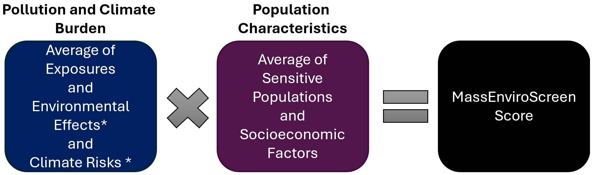

## Introduction and purpose

This document presents a tool for identifying or prioritizing the most environmentally vulnerable or burdened communities in Massachusetts based on a cumulative burden score that incorporates exposure to pollution and climate risks and the presence of sensitive or vulnerable populations, as well as whether the community meets criteria related to lower household income. It is intended to act as a supplement to the Massachusetts Environmental Justice Population definition.

This tool - MassEnviroScreen - is a hybrid approach that utilizes elements of the current [Massachusetts Environmental Justice Population definition](https://www.mass.gov/info-details/environmental-justice-populations-in-massachusetts), and a cumulative burden mapping approach. The cumulative burdens mapping approach is modeled on those used by [California EPA's CalEnviroScreen tool](https://oehha.ca.gov/calenviroscreen) and the [Colorado EnviroScreen tool](https://www.cohealthmaps.dphe.state.co.us/COEnviroscreen_2/). The California and Colorado tools utilize a 'cumulative impact score' to describe the relative environmental burden of communities across the state and to prioritize those that are most burdened. California defines cumulative impacts as "the exposures, public health or environmental effects from the combined emissions and discharges, in a geographic area, including environmental pollution from all sources, whether single or multi-media, routinely, accidentally, or otherwise released." Impacts consider “sensitive populations and socio-economic factors, where applicable and to the extent data are available.” The Colorado tool augments the CalEnviroScreen approach by adding climate risks, which is the approach followed here.

A 'cumulative burden score' is a numerical value that ranks every community (i.e., census block group) on a scale from 0 to 100. Higher values indicate greater cumulative burden. These values also represent percentile ranks, which means that a community's score also indicates the percentage of scores in a group that are equal to or lower than a given score. For example, a census block group with a score of 50 (50th percentile) means that its cumulative burden score is equal to or higher than 50% of census block groups in the state. In this model, we follow California's example of using a score of 75 (the 75th percentile) as one of the thresholds for identifying the most impacted or 'Burdened Areas.' Census block groups with a minimum score of 75 experience cumulative burdens that are equal to or higher than 75% of block groups in the state. In other words, these block group represent the top 25% of cumulative burden scores in Massachusetts.

To define "Burdened Areas" in this tool, cumulative burden percentile scores of 75 or higher are combined with one of the [existing Massachusetts EJ criteria](https://www.mass.gov/info-details/environmental-justice-populations-in-massachusetts) for low income.

::: {.callout-note appearance="simple"}
## Burdened Areas are communities (i.e., census block groups) that meet one or more of the following criteria:

-   cumulative burden percentile score (i.e, MassEnviroScore) of 75 or greater, OR
-   annual median household income is 65 percent or less of the statewide annual median household income
:::

@fig-map is an interactive map that displays 'Burdened Areas' (census block groups in red), as defined above. Click on a block group to see its MassEnviroScreen percentile score and the subscores (described in more detail later in the technical documentation) that comprise that cumulative burden, as well as other details. [Text in red]{style="color:white;background-color:#FF0000"} indicates a criterion's threshold is exceeded or met. [Text in blue]{style="color:white;background-color:#053061"} indicates a criterion's threshold is not exceeded or met. Select the checkbox next to 'MA EJ Populations' (upper right corner) to compare these Burdened Areas with block groups identified as Environmental Justice Populations under Massachusetts law. Finally, activate the 'MassEnviroScore' radio button to see cumulative burden scores for every census block group across the state.

```{r}
#| echo: false
#| warning: false
#| message: false
#| label: fig-map

# read in libraries
pacman::p_load(tidyverse, sf, tidycensus, tigris, leaflet, leaflet.extras, leaflet.providers, kableExtra)
options(tigris_use_cache = TRUE)

# read in MassEnviroScreen data from MassEnviroScreen.R
MassEnviroScreen <- readRDS("MassEnviroScreen.rds") %>% 
  select(UBA, EJ, EJ_CRIT_DESC, MassEnviroScore, NAME, COSUB, 
         PollutionBurden100, PopCharacteristics100, 
         minorityPctE, medHHincE, medHHincMAPCT, limitEngpctE, LARName, 
         starts_with("pop"), ends_with("PctSt"))

# read in county subdivisions
ma_cosubs <- county_subdivisions(state = "MA", cb = TRUE, year = 2023) %>% 
  st_transform("+proj=longlat +datum=WGS84")

# create subset of MA EJ BGs
MA_EJ23 <- MassEnviroScreen %>% 
  filter(EJ == "Yes")

# create Unfairly Burdened Areas layer
MassEnviroScreen75 <- MassEnviroScreen %>% 
  filter(UBA == "Yes")

# create palette for MassEnviroScore. need to create asymmetric palette to centered on 75. 
# identify number of rows with values below 75
x <- sum(MassEnviroScreen$MassEnviroScore < 75)
### Create an asymmetric color range
## Make vector of colors for values smaller than 75 (3830 colors)
library(RColorBrewer)
rc1 <- colorRampPalette(colors = c("#053061", "#f7f7f7"), space = "Lab")(x)
## Make vector of colors for values larger than 75 
rc2 <- colorRampPalette(colors = c("#f7f7f7", "#b2182b"), space = "Lab")(length(MassEnviroScreen$MassEnviroScore) - x)
## Combine the two color palettes
rampcols <- c(rc1, rc2)
# Create a palette to fill in the polygons
MESpal <- colorNumeric(palette = rampcols, 
                       domain = MassEnviroScreen$MassEnviroScore, 
                       na.color = NA)

# Create popup. NOTE THAT POPUP AND PALETTE MUST BE CREATED FROM EXACT SAME DF AS USED IN leaflet() MAP. OTHERWISE, POPUPS WILL SHOW UP IN THE WRONG LOCATION!
# create popups for Unfairly Burdened Areas
MES75PopUp <- paste0(MassEnviroScreen75$NAME, "<br/>",
                      "<b>Town:</b> ", MassEnviroScreen75$COSUB, "<br/>",
                      MassEnviroScreen75$popMES, round(MassEnviroScreen75$MassEnviroScore,1), "<br/>",
                      "<b>Pollution and Climate Burden SubScore:</b> ", round(MassEnviroScreen75$PollutionBurden100,1), "<br/>",
                     "<b>Sensitive Pop SubScore:</b> ", round(MassEnviroScreen75$PopCharacteristics100,1), "<br/>",
                     "<b>MA EJ Pop? </b>", MassEnviroScreen75$EJ,"<br/>",
                      "<b>Minority: </b>", paste0(round(MassEnviroScreen75$minorityPctE,1),"%"),"<br/>",
                      MassEnviroScreen75$popMHI, 
                     if_else(!is.na(MassEnviroScreen75$medHHincE), paste0("$",formatC(MassEnviroScreen75$medHHincE, format = "d", big.mark=",")), "NA"),"<br/>",
                      "<b>Limited English Households: </b>", paste0(round(MassEnviroScreen75$limitEngpctE,1)),"%", "<br/>",
                     "<b>Tribal Territory: </b>",
                     MassEnviroScreen75$popLAR, MassEnviroScreen75$LARName
                     # MassEnviroScreen75$popHLTH,
                     # if_else(!is.na(MassEnviroScreen75$HealthPctStAvg), paste0(round(MassEnviroScreen75$HealthPctStAvg,1),"%"),"NA")
                     # MassEnviroScreen75$popASTHMA, paste0(round(MassEnviroScreen75$pedAsthmaPctSt,1),"%"), "<br/>",
                     # MassEnviroScreen75$popBLL, if_else(!is.na(MassEnviroScreen75$BLLPctSt), paste0(round(MassEnviroScreen75$BLLPctSt,1),"%"), "NA"), "<br/>",
                     # MassEnviroScreen75$popLBW, if_else(!is.na(MassEnviroScreen75$LBWPctSt), paste0(round(MassEnviroScreen75$LBWPctSt,1),"%"), "NA"), "<br/>",
                     # MassEnviroScreen75$popPMR, if_else(!is.na(MassEnviroScreen75$PMRPctSt), paste0(round(MassEnviroScreen75$PMRPctSt,1),"%"), "NA"), "<br/>"
                     # MassEnviroScreen75$popCHD, if_else(!is.na(MassEnviroScreen75$CHDPctSt), paste0(round(MassEnviroScreen75$CHDPctSt,1),"%"), "NA"), "<br/>",
                     # MassEnviroScreen75$popPM25, if_else(!is.na(MassEnviroScreen75$PM25PctSt), paste0(round(MassEnviroScreen75$PM25PctSt,1),"%"), "NA"), "<br/>",
                     # MassEnviroScreen75$popOZONE, if_else(!is.na(MassEnviroScreen75$OZONEPctSt), paste0(round(MassEnviroScreen75$OZONEPctSt,1),"%"), "NA")
                     )

# repeat for MA EJ layer. if MA EJ block group is below 75th percentile, make label color for MassEnviroScore green. 
MAEJpopup <- paste0(MA_EJ23$NAME, "<br/>",
                      "<b>Town:</b> ", MA_EJ23$COSUB, "<br/>",
                      MA_EJ23$popMES, round(MA_EJ23$MassEnviroScore,1), "<br/>",
                      "<b>Pollution and Climate Burden SubScore:</b> ", round(MA_EJ23$PollutionBurden100,1), "<br/>",
                     "<b>Sensitive Pop SubScore:</b> ", round(MA_EJ23$PopCharacteristics100,1), "<br/>",
                     "<b>MA EJ Pop? </b>", MA_EJ23$EJ,"<br/>",
                      "<b>Minority: </b>", paste0(round(MA_EJ23$minorityPctE,1),"%"),"<br/>",
                      MA_EJ23$popMHI, 
                     if_else(!is.na(MA_EJ23$medHHincE), paste0("$",formatC(MA_EJ23$medHHincE, format = "d", big.mark=",")), "NA"),"<br/>",
                      "<b>Limited English Households: </b>", paste0(round(MA_EJ23$limitEngpctE,1)),"%", "<br/>",
                     "<b>Tribal Territory: </b>",
                     MA_EJ23$popLAR, MA_EJ23$LARName
                     # MA_EJ23$popHLTH,
                     # if_else(!is.na(MA_EJ23$HealthPctStAvg), paste0(round(MA_EJ23$HealthPctStAvg,1),"%"),"NA")
                     # MA_EJ23$popASTHMA, paste0(round(MA_EJ23$pedAsthmaPctSt,1),"%"), "<br/>",
                     # MA_EJ23$popBLL, if_else(!is.na(MA_EJ23$BLLPctSt), paste0(round(MA_EJ23$BLLPctSt,1),"%"), "NA"), "<br/>",
                     # MA_EJ23$popLBW, if_else(!is.na(MA_EJ23$LBWPctSt), paste0(round(MA_EJ23$LBWPctSt,1),"%"), "NA"), "<br/>",
                     # MA_EJ23$popPMR, if_else(!is.na(MA_EJ23$PMRPctSt), paste0(round(MA_EJ23$PMRPctSt,1),"%"), "NA"), "<br/>"
                     # MA_EJ23$popCHD, if_else(!is.na(MA_EJ23$CHDPctSt), paste0(round(MA_EJ23$CHDPctSt,1),"%"), "NA"), "<br/>",
                     # MA_EJ23$popPM25, if_else(!is.na(MA_EJ23$PM25PctSt), paste0(round(MA_EJ23$PM25PctSt,1),"%"), "NA"), "<br/>",
                     # MA_EJ23$popOZONE, if_else(!is.na(MA_EJ23$OZONEPctSt), paste0(round(MA_EJ23$OZONEPctSt,1),"%"), "NA")
                     )

# repeat for MassEnviroScore layer. if block group is below 75th percentile, make label text color for MassEnviroScore green. 
MESscorePopup <- paste0(MassEnviroScreen$NAME, "<br/>",
                      "<b>Town:</b> ", MassEnviroScreen$COSUB, "<br/>",
                      MassEnviroScreen$popMES, round(MassEnviroScreen$MassEnviroScore,1), "<br/>",
                      "<b>Pollution and Climate Burden SubScore:</b> ", round(MassEnviroScreen$PollutionBurden100,1), "<br/>",
                     "<b>Sensitive Pop SubScore:</b> ", round(MassEnviroScreen$PopCharacteristics100,1), "<br/>",
                     "<b>MA EJ Pop? </b>", MassEnviroScreen$EJ,"<br/>",
                      "<b>Minority: </b>", paste0(round(MassEnviroScreen$minorityPctE,1),"%"),"<br/>",
                      MassEnviroScreen$popMHI, 
                     if_else(!is.na(MassEnviroScreen$medHHincE), paste0("$",formatC(MassEnviroScreen$medHHincE, format = "d", big.mark=",")), "NA"),"<br/>",
                      "<b>Limited English Households: </b>", paste0(round(MassEnviroScreen$limitEngpctE,1)),"%", "<br/>",
                     "<b>Tribal Territory: </b>",
                     MassEnviroScreen$popLAR, MassEnviroScreen$LARName
                     # MassEnviroScreen$popHLTH,
                     # if_else(!is.na(MassEnviroScreen$HealthPctStAvg), paste0(round(MassEnviroScreen$HealthPctStAvg,1),"%"),"NA")
                     # MassEnviroScreen$popASTHMA, paste0(round(MassEnviroScreen$pedAsthmaPctSt,1),"%"), "<br/>",
                     # MassEnviroScreen$popBLL, if_else(!is.na(MassEnviroScreen$BLLPctSt), paste0(round(MassEnviroScreen$BLLPctSt,1),"%"), "NA"), "<br/>",
                     # MassEnviroScreen$popLBW, if_else(!is.na(MassEnviroScreen$LBWPctSt), paste0(round(MassEnviroScreen$LBWPctSt,1),"%"), "NA"), "<br/>",
                     # MassEnviroScreen$popPMR, if_else(!is.na(MassEnviroScreen$PMRPctSt), paste0(round(MassEnviroScreen$PMRPctSt,1),"%"), "NA"), "<br/>"
                     # MassEnviroScreen$popCHD, if_else(!is.na(MassEnviroScreen$CHDPctSt), paste0(round(MassEnviroScreen$CHDPctSt,1),"%"), "NA"), "<br/>",
                     # MassEnviroScreen$popPM25, if_else(!is.na(MassEnviroScreen$PM25PctSt), paste0(round(MassEnviroScreen$PM25PctSt,1),"%"), "NA"), "<br/>",
                     # MassEnviroScreen$popOZONE, if_else(!is.na(MassEnviroScreen$OZONEPctSt), paste0(round(MassEnviroScreen$OZONEPctSt,1),"%"), "NA")
                     )

# draw the map
leaflet() %>% 
  addProviderTiles(providers$CartoDB.Positron) %>%
  setView(-71.75, 42.1, 8) %>%
  addPolygons(data = ma_cosubs,
              weight = 0.7,
              opacity = 0,
              color = "gray",
              # fill = FALSE,
              fillOpacity = 0,
              label=~NAME, popup=~NAME) %>%
  addPolygons(data = ma_cosubs,
              weight = 0.7,
              opacity = 1,
              color = "gray",
              fill = FALSE,
              fillOpacity = 0,
              label=~NAME, popup=~NAME, 
              group='city/town boundary') %>%
  addPolygons(data = MA_EJ23, 
              weight = 0.5,
              opacity = 0.5,
              color = "black",
              fillColor = "gray",
              fillOpacity = 0.3,
              dashArray = 3,
              highlightOptions = highlightOptions(
                weight = 5,
                color = "#666",
                dashArray = "",
                fillOpacity = 0.7,
                bringToFront = TRUE),
              label = ~COSUB,
              popup = MAEJpopup,
              group = "MA EJ Populations") %>% 
  addPolygons(data = MassEnviroScreen75, 
              fillColor = "red", 
              fillOpacity = 0.5,
              dashArray = 3,
              highlightOptions = highlightOptions(
                weight = 5,
                color = "#666",
                dashArray = "",
                fillOpacity = 0.7,
                bringToFront = TRUE),
              weight = 0.5,
              color = "yellow",
              label = ~COSUB,
              popup = MES75PopUp,
              group = "Burdened Areas") %>% 
  addPolygons(data = MassEnviroScreen, 
              fillColor = ~MESpal(MassEnviroScore), 
              fillOpacity = 0.5,
              dashArray = 3,
              highlightOptions = highlightOptions(
                weight = 5,
                color = "#666",
                dashArray = "",
                fillOpacity = 0.7,
                bringToFront = TRUE),
              opacity = 0,
              weight = 0,
              # color = "white",
              label = ~COSUB,
              popup = MESscorePopup,
              group = "MassEnviroScore") %>% 
  addLayersControl(
    # baseGroups are toggle radio buttons; only 1 at at time
    baseGroups = c("Burdened Areas", "MassEnviroScore"),
    # overlayGroups are checkbox layers that can all be on or off
    overlayGroups = c("MA EJ Populations", "city/town boundary"),
    options = layersControlOptions(
      collapsed = FALSE,
      autoZIndex = TRUE)) %>% 
  hideGroup(c("MA EJ Populations", "city/town boundary")) %>% 
  addLegend(position = "bottomright",  
            colors = "red", 
            opacity = 0.5,
            title = "MassEnviroScreen",
            labels = "Burdened Areas",
            layerId = "Burdened Areas") %>% 
  addLegend(position = "bottomright",  
            pal = MESpal, 
            values = MassEnviroScreen$MassEnviroScore,
            opacity = 0.5,
            title = "MassEnviroScore",
            # labels = "MassEnviroScore",
            layerId = "MassEnviroScore") %>%
  addLegend(position = "bottomright",  
            colors = "gray", 
            opacity = 0.3,
            # title = "MA EJ Population",
            labels = "MA EJ Populations",
            group = "MA EJ Populations") %>% 
  addSearchOSM() %>% 
  # A hack to have the legends associated with radio-button "Base Groups" in R leaflet maps toggle along with layers. see https://gist.github.com/noamross/98c2053d81085517e686407096ec0a69
  htmlwidgets::onRender("
    function(el, x) {
      var initialLegend = 'Burdened Areas' // Set the initial legend to be displayed by layerId
      var myMap = this;
      for (var legend in myMap.controls._controlsById) {
        var el = myMap.controls.get(legend.toString())._container;
        if(legend.toString() === initialLegend) {
          el.style.display = 'block';
        } else {
          el.style.display = 'none';
        };
      };
    myMap.on('baselayerchange',
      function (layer) {
        for (var legend in myMap.controls._controlsById) {
          var el = myMap.controls.get(legend.toString())._container;
          if(legend.toString() === layer.name) {
            el.style.display = 'block';
          } else {
            el.style.display = 'none';
          };
        };
      });
    }")
```

## MassEnviroScreen scoring methodology

The MassEnviroScreen cumulative burden score model is based on three components representing Pollution and Climate Burden – Exposures and Environmental Effects and Climate Risks – and two components representing Population Characteristics – Sensitive Populations (e.g., in terms of health status and age) and Socioeconomic Factors.

### Model characteristics

The model:

-   Uses 30 statewide indicators to characterize both Pollution and Climate Burden and Population Characteristics
-   Uses percentiles to assign scores for each of the indicators in a given geographic area. The percentile represents a relative score for the indicators.
-   Uses a scoring system in which the percentiles are averaged for the set of indicators in each of the four components (Exposures, Environmental Effects, Climate Risks, Sensitive Populations, and Socioeconomic Factors).
-   Combines the component scores to produce a MassEnviroScreen score for a given place relative to other places in the state, using the formula below.

### Formula for calculating MassEnviroScreen Score

After the components are scored within Pollution Burden and Climate Risk or Population Characteristics, the scores are combined as follows to calculate the overall MassEnviroScreen Score:

{#fig-LABEL fig-alt="ALT"} \* The Environmental Effects and Climate Risks scores were weighted half as much as the Exposures score.

Scores for the pollution burden and climate risk and population characteristics categories are multiplied (rather than added, for example). This multiplication approach is based on research which shows that socioeconomic and health/sensitivity factors are "effect modifiers" that multiply the risks posed by pollutants and climate risks. Various environmental health and emergency response organizations use a similar scoring system: *Risk = Threat x Vulnerability*.

Within the MassEnviroScreen score map, clicking on individual census block groups shows both the final MassEnviroScreen percentile score as well as the Pollution and Climate Burden and the Sensitive Pop SubScores. The Pollution and Climate Burden Subscore represents the percentile rank (0 - 100) of the block group for averaged pollution burden and climate risk component indicators. Similarly, the Sensitive Pop SubScore represents the percentile rank (0 - 100) of the block group for averaged population characteristics component indicators.

### Model indicators

The MassEnviroScreen score model is computed from 30 statewide environmental, socioeconomic, and health indicators. These indicators are listed in @tbl-indicators below. Details and data sources for model indicators can be found in the [MassEnviroScreen Documentation](MassEnviroScreenDocumentation.pdf). The complete code for generating MassEnviroScreen is available at [https://github.com/profLuna/MassEnviroScreen](https://github.com/profLuna/MassEnviroScreen). A CSV file with indicator values for all census block groups is available [here](https://github.com/profLuna/MassEnviroScreen/blob/main/MassEnviroScreenUBAs.csv). 

```{r}
#| echo: false
#| warning: false
#| label: tbl-indicators

df <- data.frame(`Environmental Exposures` = c("PM2.5", 
                                               "Ozone", 
                                               "Nitrogen dioxide (NO2)", 
                                               "Diesel Particulate Matter", 
                                               "Drinking Water Non-compliance", 
                                               "Air Toxics Cancer Risk", 
                                               "Air Toxics Respiratory Hazard",
                                               "Proximity to Heavy Traffic"),
                 `Environmental Effects` = c("Pollution Cleanup Sites",
                                             "Groundwater Threats",
                                             "Hazardous Waste Generators and Facilities",
                                             "Solid Waste Sites and Facilities",
                                             "Impaired Water Bodies",
                                             "","",""),
                 `Climate Risks` = c("Drought",
                                             "Wildfire Risk",
                                             "Flood Risk",
                                             "Extreme Heat Days",
                                             "","","",""),
                 `Sensitive Populations` = c("Pediatric Asthma",
                                             "Low Birth Weight Infants",
                                             "Elevated Blood Lead Levels in Children",
                                             "Premature Mortality",
                                             "Adult High Blood Pressure",
                                             "Coronary Heart Disease",
                                             "Chronic Obstructive Pulmonary Disease",
                                             "Adult Cancer"),
                 `Socioeconomic Factors` = c("Adults without a High School degree",
                                             "Housing Burdened Low Income Households",
                                             "Linguistically Isolated Households",
                                             "Poverty",
                                             "Unemployment",
                                             "","",""))

df %>% 
  kbl(caption = "MassEnviroScreen Score Indicators",
      col.names = c("Environmental Exposures", "Environmental Effects", 
                    "Climate Risks",
                    "Sensitive Populations", "Socioeconomic Factors")) %>% 
  kable_styling() %>% 
  column_spec(column = c(1,2,3), color = "white", background = "#002060") %>% 
  column_spec(column = c(4,5), color = "white", background = "#50164A") %>% 
  add_header_above(c("Pollution and Climate Burden" = 3, "Population Characteristics" = 2))
```

## Comparison with Massachusetts Environmental Justice Populations

There are several key differences between the MassEnviroScreen model approach and the Massachusetts Environmental Justice Population definition:

-   The MA EJ Population definition is based on three demographic criteria - percent minority, OR percent limited English speaking households, OR percent households below 65% of statewide median household income.
-   MassEnviroScreen defines "Burdened Areas" based on a cumulative burden score that integrates demographic criteria, health status, and environmental conditions across 30 indicators, OR percent of households at or below 65% of statewide median household income.
-   MassEnviroScreen does not use race or ethnicity as indicators.

Both approaches, however, are based on important decisions about which indicators to use, and what threshold to use for prioritization. The latter are important policy decisions that may not be resolved by a technical analysis.

### Coverage of the state

Under the current Massachusetts Environmental Justice Population definition `{r} round(sum(MassEnviroScreen$EJ == "Yes")/nrow(MassEnviroScreen)*100,1)`% of Massachusetts block groups are classified as environmental justice communities. These environmental justice block groups occur in `{r} length(unique(MassEnviroScreen[MassEnviroScreen$EJ=="Yes",]$COSUB))` (`{r} round(length(unique(MassEnviroScreen[MassEnviroScreen$EJ=="Yes",]$COSUB))/351*100,1)`%) of Massachusetts municipalities (based on American Community Survey 2023 5-year estimates). By contrast, `{r} round(nrow(MassEnviroScreen[MassEnviroScreen$MassEnviroScore >= 75|MassEnviroScreen$medHHincMAPCT<=65|MassEnviroScreen$limitEngpctE>=25|MassEnviroScreen$LARName != "None",])/nrow(MassEnviroScreen)*100,1)`% of Massachusetts block groups meet the criteria for MassEnviroScreen's  Burdened Areas. The latter occur in `{r} length(unique(MassEnviroScreen[MassEnviroScreen$MassEnviroScore >= 75|MassEnviroScreen$medHHincMAPCT<=65|MassEnviroScreen$limitEngpctE>=25|MassEnviroScreen$LARName != "None",]$COSUB))` (`{r} round(length(unique(MassEnviroScreen[MassEnviroScreen$MassEnviroScore >= 75|MassEnviroScreen$medHHincMAPCT<=65|MassEnviroScreen$limitEngpctE>=25|MassEnviroScreen$LARName != "None",]$COSUB))/351*100,1)`%) of Massachusetts municipalities. A breakdown of the number and percentage of census block groups meeting the various criteria that define a an Burdened Area are displayed in @tbl-criteria. Note that percentages do not total to 100% because block groups may meet multiple criteria.

```{r}
#| echo: false
#| warning: false
#| label: tbl-criteria

# create table with breakdown of UBAs by criterion
MES75s <- MassEnviroScreen %>% 
  filter(round(MassEnviroScore) >= 75) %>% 
  nrow()
MHHIs <- MassEnviroScreen %>% 
  filter(round(medHHincMAPCT) <= 65) %>% 
  nrow()
# HLTH <- MassEnviroScreen %>% 
#   filter(round(HealthPctStAvg) >= 150) %>% 
#   nrow()
# LEPs <- MassEnviroScreen %>% 
#   filter(limitEngpctE >= 25) %>% 
#   nrow()
# LARs <- MassEnviroScreen %>% 
#   filter(LARName != "None") %>% 
#   nrow()
# Asthmas <- MassEnviroScreen %>% 
#   filter(pedAsthmaPctSt > 200) %>% 
#   nrow()
# LBWs <- MassEnviroScreen %>% 
#   filter(LBWPctSt > 200) %>% 
#   nrow()
# BLLs <- MassEnviroScreen %>% 
#   filter(LBWPctSt > 200) %>% 
#   nrow()
# PMRs <- MassEnviroScreen %>% 
#   filter(PMRPctSt > 200) %>% 
#   nrow()
# CHDs <- MassEnviroScreen %>% 
#   filter(CHDPctSt > 200) %>% 
#   nrow()
# OZONEs <- MassEnviroScreen %>% 
#   filter(OZONEPctSt > 200) %>% 
#   nrow()
# PM25s <- MassEnviroScreen %>% 
#   filter(PM25PctSt > 200) %>% 
#   nrow()

# create the table
data.frame(Indicator = c("MassEnviroScreen Score >= 75%tile", 
                         "Median Household Income <= 65% MA"
                         # "Avg Health Percent of State >= 150%"
                         # "Limited English Households >= 25%", "Tribal Territory", 
                         # "Pediatric Asthma >= 200% MA", "Low Birthweight >= 200% MA", 
                         # "Elevated Blood Lead Levels >= 200% MA", 
                         # "Premature Mortality >= 200% MA"
                         ),
                   `Block Groups` = c(MES75s, MHHIs)) %>% 
  mutate(PctUBAs = paste0(round(Block.Groups/MassEnviroScreen %>% 
                                  filter(UBA=="Yes") %>% nrow()*100, 1),"%"),
         PctStateBGs = paste0(round(Block.Groups/nrow(MassEnviroScreen)*100, 1),"%")) %>% 
  arrange(., desc(Block.Groups)) %>% 
  kable(caption = "Criteria for Burdened Areas", 
        col.names = c("BA Criteria", "Number of Block Groups", "Pct of BAs", 
                      "Pct of State Block Groups"),
        align = "l") %>% 
  kable_styling(bootstrap_options = c("striped", "hover"))
```

### Overlap with EJ criteria

Although MassEnviroScreen identifies a smaller number of census block groups, there is considerable overlap between communities meeting the state's current environmental justice population definition and the criteria for Burdened Areas. Although `{r} round(nrow(MassEnviroScreen[MassEnviroScreen$MassEnviroScore >= 75|MassEnviroScreen$medHHincMAPCT<=65|MassEnviroScreen$limitEngpctE>=25|MassEnviroScreen$LARName != "None",])/nrow(MassEnviroScreen)*100,1)`% of census block groups in the state meet the criteria for Burdened Areas, `{r}  round(nrow(MassEnviroScreen[(MassEnviroScreen$MassEnviroScore >= 75|MassEnviroScreen$medHHincMAPCT<=65|MassEnviroScreen$limitEngpctE>=25|MassEnviroScreen$LARName != "None") & MassEnviroScreen$EJ=="Yes",])/nrow(MassEnviroScreen[MassEnviroScreen$EJ=="Yes",])*100,1)`% of block groups defined as environmental justice populations also meet the Burdened Areas criteria. @fig-EJoverlap shows the degree of overlap between the various criteria of environmental justice populations and Burdened Areas. There is 75% - 100% overlap with five out of the seven state Environmental Justice Population criteria. However, only 32% of census block groups defined as a Environmental Justice Population based solely on the Minority criterion (i.e., 40% or more minority), and 33% of those defined solely on the limited English proficiency criterion, overlap with Burdened Areas as defined here.

```{r}
#| echo: false
#| warning: false
#| label: fig-EJoverlap
#| out-width: 100%

MassEnviroScreen %>% 
  st_drop_geometry(.) %>% 
  filter(EJ == "Yes" | UBA == "Yes") %>% 
  group_by(EJ_CRIT_DESC, UBA) %>% 
  summarize(count = n()) %>% 
  # ungroup() %>% # if used, pct is proportion of all state BGs, not just EJ. more like a basic x-tab of UBA-EJ across the state
  mutate(pct = round(count/sum(count)*100, 1),
         pctLabel = paste0(round(pct,0),"%")) %>% 
  filter(UBA == "Yes" & EJ_CRIT_DESC != "") %>%
  arrange(desc(pct)) %>% 
  ggplot(aes(x = reorder(EJ_CRIT_DESC, pct), y = pct, fill = EJ_CRIT_DESC)) +
  geom_col() +
  coord_flip() +
  labs(title = "MA EJ Population Criteria Overlap with\nMassEnviroScreen Burdened Areas", caption = "Based on percentage of EJ census block groups") +
  xlab("") + ylab("") +
  scale_y_continuous(labels = scales::percent_format(scale = 1)) +
  scale_fill_manual(values = c(
    "Low Income and Limited English and Minority" = "navyblue",
    "Limited English and Minority" = "deeppink",
    "Limited English" = "lightskyblue",
    "Low Income and Minority" = "darkgreen",
    "Low Income and Limited English" = "cyan",
    "Minority" = "gold",
    "Low Income" = "lawngreen")) +
  theme(legend.position = "none") +
  geom_text(aes(label = pctLabel), vjust = 0.5, hjust = 1.1, colour = "white")
```

### MassEnviroScreen cumulative burden scores by EJ criteria

@fig-EJscores shows the distribution of MassEnviroScreen cumulative burden scores for block groups meeting each of the environmental justice criteria. In comparison to non-EJ block groups in Massachusetts, median cumulative burden scores for six out of the seven EJ criteria are above the 50th percentile. In other words, most block groups meeting the state's current environmental justice population definition have cumulative burden scores that are higher than 50% of block groups across the state overall. In addition, four out of the seven also have median values above the 75th percentile or threshold for Burdened Areas.

```{r}
#| echo: false
#| warning: false
#| label: fig-EJscores
#| out-width: 100%
# # Compare the number/percent of block groups, population, and municipalities that are EJ vs DAC
# create boxplot percentile scores by EJ category
MassEnviroScreen %>% 
  st_drop_geometry(.) %>% 
  mutate(EJ_CRIT_DESC = if_else(EJ_CRIT_DESC == "", "NON-EJ", EJ_CRIT_DESC)) %>% 
  ggplot() +
  geom_boxplot(aes(x = reorder(EJ_CRIT_DESC, MassEnviroScore), 
                   y = MassEnviroScore,
                   fill = EJ_CRIT_DESC)) +
  coord_flip() +
  labs(title = "Distribution of MassEnviroScore by MA EJ Population\nCriteria") +
  xlab("") +
  scale_fill_manual(values = c(
    "Low Income and Limited English and Minority" = "navyblue",
    "Limited English and Minority" = "deeppink",
    "Limited English" = "lightskyblue",
    "Low Income and Minority" = "darkgreen",
    "Low Income and Limited English" = "cyan",
    "Minority" = "gold",
    "Low Income" = "lawngreen",
    "NON-EJ" = "gray88")) +
  theme(legend.position = "none")
```

## Next Steps?

This report is a draft product for discussion.

Questions about this report should be directed to:

Marcos Luna, PhD Professor, Geography and Sustainability Department Salem State University Salem, MA mluna at salemstate.edu
